social_rent_rdd_markdown
================
Michael Marshall
24/03/2022

# Background: Evidence from a natural experiment on the effects of grant funding on social rented housing delivery

## Data and methodology

In October 2017, the government announced it would provide additional
funding for the supply of new social rented housing via Homes England.
But it would only provide additional funding in areas of [‘high
affordability
pressure’](%22https://www.gov.uk/government/publications/areas-of-high-affordability-pressure/list-areas-of-high-affordability-pressure%22),
defined by the government as local authorities where the gap between
average social rents and average private rents is 50 GBP or more.

The analysis below views this policy as a natural experiment, whereby
the treatment is whether social rent is grant funded in a local
authority or not, and the outcome is the rate of social rent delivery
within a local authority in a given year.

The data for the analysis is:

-   [DLUHC: Live table 1011S: Additional Affordable Housing Supply;
    detailed breakdown by Local Authority, Starts on
    site](https://www.gov.uk/government/statistical-data-sets/live-tables-on-affordable-housing-supply)  
-   [DLUHC: Live table 125: dwelling stock estimates by local authority
    district](https://www.gov.uk/government/statistical-data-sets/live-tables-on-dwelling-stock-including-vacants)  
-   [RSH: Statistical data return (SDR) for private registered
    providers, years 2015/16 to
    2019/20](https://www.gov.uk/government/collections/statistical-data-return-statistical-releases)  
-   [VOA: Private rental market statistics, years 2015/16 to
    2017/18](https://www.gov.uk/government/collections/private-rental-market-statistics)  
-   [ONS: Private rental market summary statistics in England, years
    2018/19 to
    2019/20](https://www.ons.gov.uk/peoplepopulationandcommunity/housing/datasets/privaterentalmarketsummarystatisticsinengland)

Within the dataset, each observation is a local authority within a given
year. London local authorities are excluded as they are funded via the
Greater London Authority (GLA), not Homes England. The continuous
variable that defines the treatment is the gap between average social
rents and private rents in GBP, and this is calculated using the SDR,
VOA and ONS data (as per the Homes England explanation of their
methodology). The treatment is having an affordability gap above 50 GBP.
The outcome variable is the number of social rent starts on site within
a given local authority. However, this outcome is calculated in three
different ways, yielding three dependent variables:

1.  Social rent starts as a proportion of all affordable homes starts
    within the local authority  
2.  Social rent starts as a rate per 1,000 existing dwellings in the
    local authority  
3.  Social rent starts by housing associations (also known as Private
    Registered Providers, hereby PRPs), as a rate per 1,000 existing
    dwellings in the local authority

The research question is *“what effect did the increase in social rent
grant funding have on the rate of social rent delivery in local
authorities, especially social rented housing delivered by PRPs?”*
However, two other dependent variables are modelled in the analysis as
comparators. The comparator dependent variables, and their purposes as
comparators, are:

-   Total affordable homes starts as a rate per 1,000 dwellings in the
    local authority – used to understand whether there is a multiplier
    effect from social rent grant funding i.e. is grant being used to
    deliver more homes overall, or to deliver the same number of homes
    but with a higher proportion of social rent?  
-   Total affordable rent starts as a rate per 1,000 dwellings in the
    local authority – used as a placebo to provide increased confidence
    that any treatment effect identified in the analysis is genuine. In
    other words, we should expect to see no effect on affordable rent
    starts from increased social rent funding, and so if we find an
    effect for social renting but not affordable renting, this increases
    our confidence the social rent treatment effect is genuine and not a
    result of chance.

The analysis uses a regression discontinuity design (RDD) to model the
treatment effect of grant funding. RDD offers a methodology for causal
inference in natural experiments where a disjuncture in a continuous
independent variable defines the binary treatment variable. In other
words, the affordability gap between social and private rents features a
*discontinuity* at the 50 GBP point, around which the treatment status
switches from control (i.e. no grant) to treatment (i.e. grant funding).
A binary dummy variable for the presence of treatment is included in a
regression analysis, controlling for the continuous affordability gap
variable (centred at the point of discontinuity). As such the model
intercept is the average social rented delivery in the control group,
and the coefficient of the treatment dummy variable is the
*average-treatment-effect-on-the-treated (ATT)*.

Due to the non-randomisation of the treatment status in an RDD, the ATT
estimate only applies to observations around the point of discontinuity
(i.e. those close to the 50 GBP threshold). Therefore, it is common to
conduct a sensitvity analysis whereby the RDD is repeated on a subsample
of observations close to the point of discontinuity. This analysis also
assumes a simple linear regression model for the functional form of the
running varibale (i.e. affordability gap). Different functional forms
could obviously be modelled. But the visualisations of the ATTs
(i.e. Figures 7 to 11) suggest the relationship between affordability
gap and social rent output, independent of the funding policy treatment,
is orthogonal. And therefore the effect of affordability gap is unlikely
to differ substantially in different specifications of the model.

Finally, although the funding was announced in October 2017, there is
likely to be a lag before any treatment effect is identifiable. This is
demonstrated by the exploratory visualisations below, in particular
Figures 4 and 5. This is attributable to the numerous administrative and
logistical steps involved in going from a grant application to actually
starting on site, a process which can take a number of years. Prior to
conducting RDD, a set of longitudinal models were produced for each
dependent variable. The longitudinal models use a multilevel modelling
framework, including random intercepts for each local authority. Three
longitudinal models were produced per dependent variable, varying in
terms of their fixed effects, which are as follows:

1.  an additive model with independent fixed effects for the treatment
    variable and a categorical variable for year  
2.  interaction model with treatment status interacted with each year
    category in the year variable  
3.  interaction model with treatment status interacting with *only* the
    2019/20 category in year (all other years included as independent
    fixed effects)

The longitudinal models revealed that the model fit – as measured by AIC
– was optimised in model 3, whereby treatment interacts with 2019/20
only. The results of these models are shown below with respect to the
*social rent starts as a proportion of all affordable homes starts*
dependent variable, but this pattern was replicated across all three
dependent variables. The findings of the longitudinal model suggest a
treatment effect from grant funding is plausible, but may not have
appeared until 2019/20. As such, the RDD compares the ATT between
2015/16 (pre-treatment) and 2019/20 (post-treatment) for each dependent
variable. Prior to modelling, though, a number of exploratory
visualisations are presented.

# Exploratory visualisations

Figure 1 shows all affordable home starts by tenure and year, including
London local authorities. There is a clear increase in social rent as a
proportion of all affordable homes post-2015-16. And when London
Affordable Rent is included (which has grant and rent levels comparable
to social rent), this growth is even higher. There is the potential for
this trend to be an administrative artifice, though. As there is also an
increased number of ‘unknown’ tenure construction starts over time, and
so these proportions could shift as the eventual tenure is determined
upon completion. Moreover, the proportion of social rented homes does
not compare local authority supply according to a common baseline, as
the proportion will fluctuate according to the size of the denominator
(i.e. the overall rate of affordable housing delivery in a local
authority), which is one of the motivating factors for including a
dependent variable with social renting as a rate per 1,000 existing
dwellings. Nevertheless, Figure 1 still provides suggestive evidence
that social rent supply grew over the period in question.

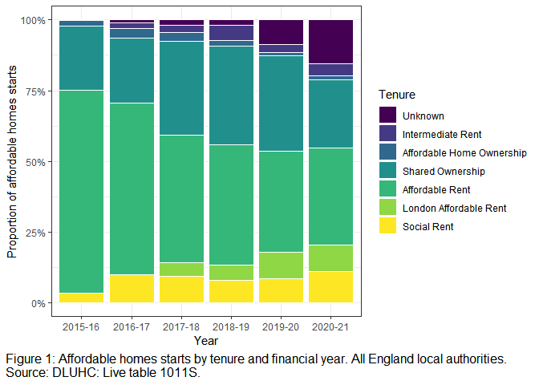<!-- -->

Figure 2 replicates Figure 1, but excludes London local authorities. And
shows a similar trend in terms of the proportion of social rented
starts.

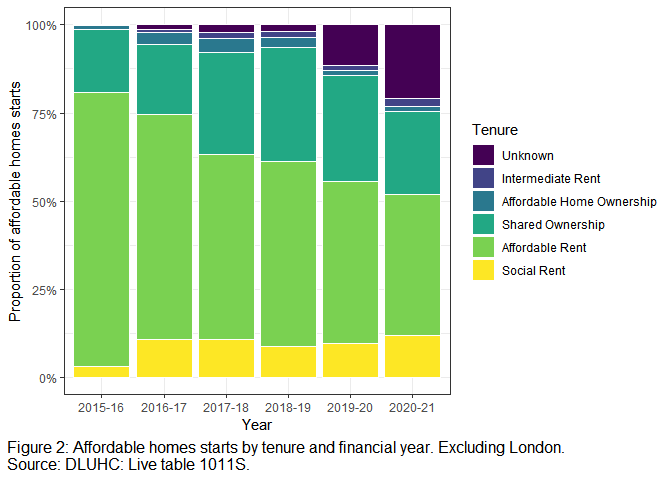<!-- -->

Figure 3 shows social rent starts as a proportion of all affordable
homes starts, and disaggregates by scheme type. Unsurprisingly, the
largest growth in social rented proportion has been in schemes funded by
Homes England or the GLA. The proportion of social renting is broadly
stable in ‘other funding’ schemes (i.e. non-grant funded). Figure 3
shows all local authorities, including London.

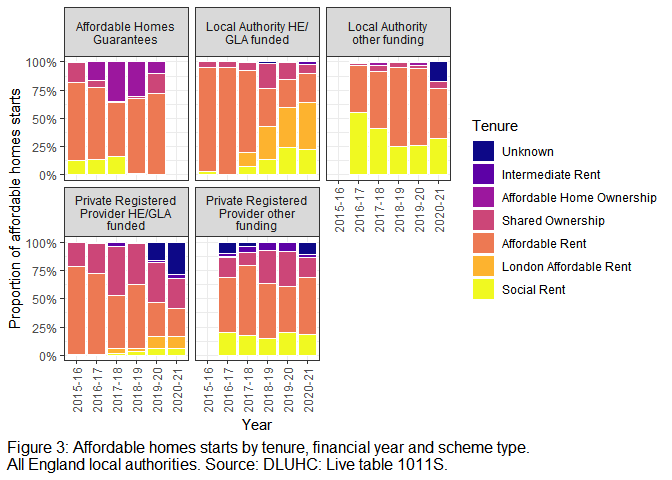<!-- -->

Figure 4 shows the rate of social renting starts per 1,000 existing
dwellings in a local authority. It disaggregates the rate by treatment
status, showing whether a local authority is *high affordability
pressure* or not (1 = high pressure). Figure 4 shows the lagged effect
of the funding change.

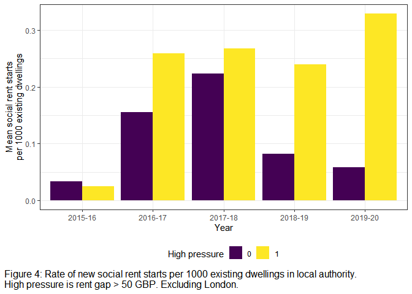<!-- -->

Figure 5 replicates Figure 4, but separates the rate of new social rent
delivery by whether it is delivered by either a PRP or a local authority
(LA). The trend is broadly similar until the sharp increase in PRP
delivery in high pressure local authorities in 2019/20.

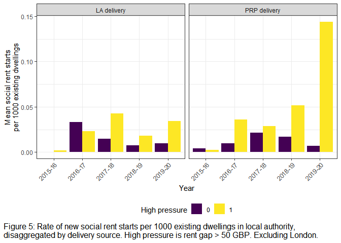<!-- -->

Figure 6 shows the rate of delivery for affordable rent (i.e. the
placebo). There is little overall change in affordable rent delivery
over time, and little variation according to treatment status.

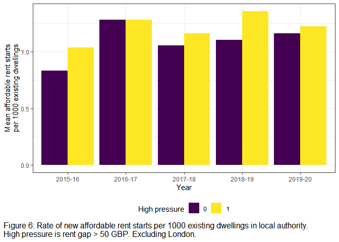<!-- -->

# Modelling

## Longitudinal modelling

The tables below show the results of the longitudinal models where the
dependent variable is social rented starts as a proportion of total
affordable homes starts. The first model is the additive model with no
interactions. It shows no effect of the treatment, but a general
increase in the proportion of social rented housing each year relative
to the 2015/16 baseline.

<table class="table table-striped table-hover table-condensed table-responsive" style="width: auto !important; margin-left: auto; margin-right: auto;">
<tbody>
<tr>
<td style="text-align:left;font-weight: bold;">
Observations
</td>
<td style="text-align:right;">
1390
</td>
</tr>
<tr>
<td style="text-align:left;font-weight: bold;">
Dependent variable
</td>
<td style="text-align:right;">
prop_sr
</td>
</tr>
<tr>
<td style="text-align:left;font-weight: bold;">
Type
</td>
<td style="text-align:right;">
Mixed effects linear regression
</td>
</tr>
</tbody>
</table>
<table class="table table-striped table-hover table-condensed table-responsive" style="width: auto !important; margin-left: auto; margin-right: auto;">
<tbody>
<tr>
<td style="text-align:left;font-weight: bold;">
AIC
</td>
<td style="text-align:right;">
-989.01
</td>
</tr>
<tr>
<td style="text-align:left;font-weight: bold;">
BIC
</td>
<td style="text-align:right;">
-941.87
</td>
</tr>
<tr>
<td style="text-align:left;font-weight: bold;">
Pseudo-R² (fixed effects)
</td>
<td style="text-align:right;">
0.02
</td>
</tr>
<tr>
<td style="text-align:left;font-weight: bold;">
Pseudo-R² (total)
</td>
<td style="text-align:right;">
0.25
</td>
</tr>
</tbody>
</table>
<table class="table table-striped table-hover table-condensed table-responsive" style="width: auto !important; margin-left: auto; margin-right: auto;border-bottom: 0;">
<thead>
<tr>
<th style="border-bottom:hidden;padding-bottom:0; padding-left:3px;padding-right:3px;text-align: center; " colspan="6">

Fixed Effects

</th>
</tr>
<tr>
<th style="text-align:left;">
</th>
<th style="text-align:right;">
Est.
</th>
<th style="text-align:right;">
S.E.
</th>
<th style="text-align:right;">
t val.
</th>
<th style="text-align:right;">
d.f.
</th>
<th style="text-align:right;">
p
</th>
</tr>
</thead>
<tbody>
<tr>
<td style="text-align:left;font-weight: bold;">
(Intercept)
</td>
<td style="text-align:right;">
0.02
</td>
<td style="text-align:right;">
0.01
</td>
<td style="text-align:right;">
1.95
</td>
<td style="text-align:right;">
1128.42
</td>
<td style="text-align:right;">
0.05
</td>
</tr>
<tr>
<td style="text-align:left;font-weight: bold;">
treatment
</td>
<td style="text-align:right;">
0.02
</td>
<td style="text-align:right;">
0.02
</td>
<td style="text-align:right;">
1.30
</td>
<td style="text-align:right;">
974.13
</td>
<td style="text-align:right;">
0.19
</td>
</tr>
<tr>
<td style="text-align:left;font-weight: bold;">
Year2016-17
</td>
<td style="text-align:right;">
0.05
</td>
<td style="text-align:right;">
0.01
</td>
<td style="text-align:right;">
3.84
</td>
<td style="text-align:right;">
1112.89
</td>
<td style="text-align:right;">
0.00
</td>
</tr>
<tr>
<td style="text-align:left;font-weight: bold;">
Year2017-18
</td>
<td style="text-align:right;">
0.06
</td>
<td style="text-align:right;">
0.01
</td>
<td style="text-align:right;">
4.41
</td>
<td style="text-align:right;">
1130.51
</td>
<td style="text-align:right;">
0.00
</td>
</tr>
<tr>
<td style="text-align:left;font-weight: bold;">
Year2018-19
</td>
<td style="text-align:right;">
0.04
</td>
<td style="text-align:right;">
0.01
</td>
<td style="text-align:right;">
3.33
</td>
<td style="text-align:right;">
1163.35
</td>
<td style="text-align:right;">
0.00
</td>
</tr>
<tr>
<td style="text-align:left;font-weight: bold;">
Year2019-20
</td>
<td style="text-align:right;">
0.05
</td>
<td style="text-align:right;">
0.01
</td>
<td style="text-align:right;">
4.03
</td>
<td style="text-align:right;">
1185.68
</td>
<td style="text-align:right;">
0.00
</td>
</tr>
<tr>
<td style="text-align:left;font-weight: bold;">
I(afford_gap_median - 50)
</td>
<td style="text-align:right;">
0.00
</td>
<td style="text-align:right;">
0.00
</td>
<td style="text-align:right;">
0.70
</td>
<td style="text-align:right;">
501.54
</td>
<td style="text-align:right;">
0.49
</td>
</tr>
</tbody>
<tfoot>
<tr>
<td style="padding: 0; " colspan="100%">
 p values calculated using Satterthwaite d.f.
</td>
</tr>
</tfoot>
</table>
<table class="table table-striped table-hover table-condensed table-responsive" style="width: auto !important; margin-left: auto; margin-right: auto;">
<thead>
<tr>
<th style="border-bottom:hidden;padding-bottom:0; padding-left:3px;padding-right:3px;text-align: center; " colspan="3">

Random Effects

</th>
</tr>
<tr>
<th>
Group
</th>
<th>
Parameter
</th>
<th>
Std. Dev.
</th>
</tr>
</thead>
<tbody>
<tr>
<td>
LA code
</td>
<td>
(Intercept)
</td>
<td>
0.08
</td>
</tr>
<tr>
<td>
Residual
</td>
<td>
</td>
<td>
0.15
</td>
</tr>
</tbody>
</table>
<table class="table table-striped table-hover table-condensed table-responsive" style="width: auto !important; margin-left: auto; margin-right: auto;">
<thead>
<tr>
<th style="border-bottom:hidden;padding-bottom:0; padding-left:3px;padding-right:3px;text-align: center; " colspan="3">

Grouping Variables

</th>
</tr>
<tr>
<th>
Group
</th>
<th>
# groups
</th>
<th>
ICC
</th>
</tr>
</thead>
<tbody>
<tr>
<td>
LA code
</td>
<td>
297
</td>
<td>
0.23
</td>
</tr>
</tbody>
</table>

The second longitudinal model includes an interaction between treatment
and each category of the year variable. This analysis adopts the
recommendations of [Benjamin et
al. (2017)](https://www.nature.com/articles/s41562-017-0189-z) regarding
statistical significance thresholds when identifying novel effects. To
reduce the likelihood of false positives, they recommend a threshold of
0.005 for statistical significance, and that the traditional threshold
of 0.05 should be rebranded as ‘suggestive’ of an association. According
to these criteria, a statistically significant effect is found for the
interaction between treatment and 2019/20 but none of the other years.
The interaction between treatment and 2016/17 is suggestive of an
effect, but the AIC statistic is worse (suggesting potential
overfitting). Plus, the interaction between 2016/17 and treatment was
non-significant for the other two dependent variables (i.e. social rent
as a rate of all dwellings, social rent by PRPs as a rate of all
dwellings). So it was decided to focus on the interaction between
treatment and 2019/20.

<table class="table table-striped table-hover table-condensed table-responsive" style="width: auto !important; margin-left: auto; margin-right: auto;">
<tbody>
<tr>
<td style="text-align:left;font-weight: bold;">
Observations
</td>
<td style="text-align:right;">
1390
</td>
</tr>
<tr>
<td style="text-align:left;font-weight: bold;">
Dependent variable
</td>
<td style="text-align:right;">
prop_sr
</td>
</tr>
<tr>
<td style="text-align:left;font-weight: bold;">
Type
</td>
<td style="text-align:right;">
Mixed effects linear regression
</td>
</tr>
</tbody>
</table>
<table class="table table-striped table-hover table-condensed table-responsive" style="width: auto !important; margin-left: auto; margin-right: auto;">
<tbody>
<tr>
<td style="text-align:left;font-weight: bold;">
AIC
</td>
<td style="text-align:right;">
-978.91
</td>
</tr>
<tr>
<td style="text-align:left;font-weight: bold;">
BIC
</td>
<td style="text-align:right;">
-910.83
</td>
</tr>
<tr>
<td style="text-align:left;font-weight: bold;">
Pseudo-R² (fixed effects)
</td>
<td style="text-align:right;">
0.03
</td>
</tr>
<tr>
<td style="text-align:left;font-weight: bold;">
Pseudo-R² (total)
</td>
<td style="text-align:right;">
0.26
</td>
</tr>
</tbody>
</table>
<table class="table table-striped table-hover table-condensed table-responsive" style="width: auto !important; margin-left: auto; margin-right: auto;border-bottom: 0;">
<thead>
<tr>
<th style="border-bottom:hidden;padding-bottom:0; padding-left:3px;padding-right:3px;text-align: center; " colspan="6">

Fixed Effects

</th>
</tr>
<tr>
<th style="text-align:left;">
</th>
<th style="text-align:right;">
Est.
</th>
<th style="text-align:right;">
S.E.
</th>
<th style="text-align:right;">
t val.
</th>
<th style="text-align:right;">
d.f.
</th>
<th style="text-align:right;">
p
</th>
</tr>
</thead>
<tbody>
<tr>
<td style="text-align:left;font-weight: bold;">
(Intercept)
</td>
<td style="text-align:right;">
0.04
</td>
<td style="text-align:right;">
0.01
</td>
<td style="text-align:right;">
2.84
</td>
<td style="text-align:right;">
1352.12
</td>
<td style="text-align:right;">
0.00
</td>
</tr>
<tr>
<td style="text-align:left;font-weight: bold;">
treatment
</td>
<td style="text-align:right;">
-0.01
</td>
<td style="text-align:right;">
0.02
</td>
<td style="text-align:right;">
-0.67
</td>
<td style="text-align:right;">
1371.87
</td>
<td style="text-align:right;">
0.50
</td>
</tr>
<tr>
<td style="text-align:left;font-weight: bold;">
Year2016-17
</td>
<td style="text-align:right;">
0.02
</td>
<td style="text-align:right;">
0.02
</td>
<td style="text-align:right;">
1.21
</td>
<td style="text-align:right;">
1122.24
</td>
<td style="text-align:right;">
0.22
</td>
</tr>
<tr>
<td style="text-align:left;font-weight: bold;">
Year2017-18
</td>
<td style="text-align:right;">
0.06
</td>
<td style="text-align:right;">
0.02
</td>
<td style="text-align:right;">
3.26
</td>
<td style="text-align:right;">
1143.33
</td>
<td style="text-align:right;">
0.00
</td>
</tr>
<tr>
<td style="text-align:left;font-weight: bold;">
Year2018-19
</td>
<td style="text-align:right;">
0.03
</td>
<td style="text-align:right;">
0.02
</td>
<td style="text-align:right;">
1.26
</td>
<td style="text-align:right;">
1170.73
</td>
<td style="text-align:right;">
0.21
</td>
</tr>
<tr>
<td style="text-align:left;font-weight: bold;">
Year2019-20
</td>
<td style="text-align:right;">
-0.01
</td>
<td style="text-align:right;">
0.02
</td>
<td style="text-align:right;">
-0.45
</td>
<td style="text-align:right;">
1171.79
</td>
<td style="text-align:right;">
0.65
</td>
</tr>
<tr>
<td style="text-align:left;font-weight: bold;">
I(afford_gap_median - 50)
</td>
<td style="text-align:right;">
0.00
</td>
<td style="text-align:right;">
0.00
</td>
<td style="text-align:right;">
0.56
</td>
<td style="text-align:right;">
497.03
</td>
<td style="text-align:right;">
0.58
</td>
</tr>
<tr>
<td style="text-align:left;font-weight: bold;">
treatment:Year2016-17
</td>
<td style="text-align:right;">
0.05
</td>
<td style="text-align:right;">
0.03
</td>
<td style="text-align:right;">
2.01
</td>
<td style="text-align:right;">
1134.38
</td>
<td style="text-align:right;">
0.04
</td>
</tr>
<tr>
<td style="text-align:left;font-weight: bold;">
treatment:Year2017-18
</td>
<td style="text-align:right;">
-0.00
</td>
<td style="text-align:right;">
0.03
</td>
<td style="text-align:right;">
-0.12
</td>
<td style="text-align:right;">
1151.91
</td>
<td style="text-align:right;">
0.90
</td>
</tr>
<tr>
<td style="text-align:left;font-weight: bold;">
treatment:Year2018-19
</td>
<td style="text-align:right;">
0.04
</td>
<td style="text-align:right;">
0.03
</td>
<td style="text-align:right;">
1.33
</td>
<td style="text-align:right;">
1175.49
</td>
<td style="text-align:right;">
0.19
</td>
</tr>
<tr>
<td style="text-align:left;font-weight: bold;">
treatment:Year2019-20
</td>
<td style="text-align:right;">
0.10
</td>
<td style="text-align:right;">
0.03
</td>
<td style="text-align:right;">
3.80
</td>
<td style="text-align:right;">
1178.61
</td>
<td style="text-align:right;">
0.00
</td>
</tr>
</tbody>
<tfoot>
<tr>
<td style="padding: 0; " colspan="100%">
 p values calculated using Satterthwaite d.f.
</td>
</tr>
</tfoot>
</table>
<table class="table table-striped table-hover table-condensed table-responsive" style="width: auto !important; margin-left: auto; margin-right: auto;">
<thead>
<tr>
<th style="border-bottom:hidden;padding-bottom:0; padding-left:3px;padding-right:3px;text-align: center; " colspan="3">

Random Effects

</th>
</tr>
<tr>
<th>
Group
</th>
<th>
Parameter
</th>
<th>
Std. Dev.
</th>
</tr>
</thead>
<tbody>
<tr>
<td>
LA code
</td>
<td>
(Intercept)
</td>
<td>
0.08
</td>
</tr>
<tr>
<td>
Residual
</td>
<td>
</td>
<td>
0.15
</td>
</tr>
</tbody>
</table>
<table class="table table-striped table-hover table-condensed table-responsive" style="width: auto !important; margin-left: auto; margin-right: auto;">
<thead>
<tr>
<th style="border-bottom:hidden;padding-bottom:0; padding-left:3px;padding-right:3px;text-align: center; " colspan="3">

Grouping Variables

</th>
</tr>
<tr>
<th>
Group
</th>
<th>
# groups
</th>
<th>
ICC
</th>
</tr>
</thead>
<tbody>
<tr>
<td>
LA code
</td>
<td>
297
</td>
<td>
0.23
</td>
</tr>
</tbody>
</table>

The table below shows the longitudinal analysis results for the model
with an interaction between 2019/20 and treatment only. This interaction
effect is statistically significant, and the AIC statistic of this model
is the best of each models. These patterns of statistical significance
and model fit were replicated across each three dependent variables. In
fact, the reduction in AIC from the additive model to the 2019/20
interaction only model was greatest for the *rate of social rent by PRPs
per 1,000 existing dwellings* dependent variable.

<table class="table table-striped table-hover table-condensed table-responsive" style="width: auto !important; margin-left: auto; margin-right: auto;">
<tbody>
<tr>
<td style="text-align:left;font-weight: bold;">
Observations
</td>
<td style="text-align:right;">
1390
</td>
</tr>
<tr>
<td style="text-align:left;font-weight: bold;">
Dependent variable
</td>
<td style="text-align:right;">
prop_sr
</td>
</tr>
<tr>
<td style="text-align:left;font-weight: bold;">
Type
</td>
<td style="text-align:right;">
Mixed effects linear regression
</td>
</tr>
</tbody>
</table>
<table class="table table-striped table-hover table-condensed table-responsive" style="width: auto !important; margin-left: auto; margin-right: auto;">
<tbody>
<tr>
<td style="text-align:left;font-weight: bold;">
AIC
</td>
<td style="text-align:right;">
-995.30
</td>
</tr>
<tr>
<td style="text-align:left;font-weight: bold;">
BIC
</td>
<td style="text-align:right;">
-942.93
</td>
</tr>
<tr>
<td style="text-align:left;font-weight: bold;">
Pseudo-R² (fixed effects)
</td>
<td style="text-align:right;">
0.03
</td>
</tr>
<tr>
<td style="text-align:left;font-weight: bold;">
Pseudo-R² (total)
</td>
<td style="text-align:right;">
0.25
</td>
</tr>
</tbody>
</table>
<table class="table table-striped table-hover table-condensed table-responsive" style="width: auto !important; margin-left: auto; margin-right: auto;border-bottom: 0;">
<thead>
<tr>
<th style="border-bottom:hidden;padding-bottom:0; padding-left:3px;padding-right:3px;text-align: center; " colspan="6">

Fixed Effects

</th>
</tr>
<tr>
<th style="text-align:left;">
</th>
<th style="text-align:right;">
Est.
</th>
<th style="text-align:right;">
S.E.
</th>
<th style="text-align:right;">
t val.
</th>
<th style="text-align:right;">
d.f.
</th>
<th style="text-align:right;">
p
</th>
</tr>
</thead>
<tbody>
<tr>
<td style="text-align:left;font-weight: bold;">
(Intercept)
</td>
<td style="text-align:right;">
0.03
</td>
<td style="text-align:right;">
0.01
</td>
<td style="text-align:right;">
2.52
</td>
<td style="text-align:right;">
1152.05
</td>
<td style="text-align:right;">
0.01
</td>
</tr>
<tr>
<td style="text-align:left;font-weight: bold;">
treatment
</td>
<td style="text-align:right;">
0.01
</td>
<td style="text-align:right;">
0.02
</td>
<td style="text-align:right;">
0.36
</td>
<td style="text-align:right;">
1053.47
</td>
<td style="text-align:right;">
0.72
</td>
</tr>
<tr>
<td style="text-align:left;font-weight: bold;">
`1920`
</td>
<td style="text-align:right;">
0.00
</td>
<td style="text-align:right;">
0.02
</td>
<td style="text-align:right;">
0.08
</td>
<td style="text-align:right;">
1161.27
</td>
<td style="text-align:right;">
0.94
</td>
</tr>
<tr>
<td style="text-align:left;font-weight: bold;">
`1819`
</td>
<td style="text-align:right;">
0.05
</td>
<td style="text-align:right;">
0.01
</td>
<td style="text-align:right;">
3.56
</td>
<td style="text-align:right;">
1163.83
</td>
<td style="text-align:right;">
0.00
</td>
</tr>
<tr>
<td style="text-align:left;font-weight: bold;">
`1718`
</td>
<td style="text-align:right;">
0.06
</td>
<td style="text-align:right;">
0.01
</td>
<td style="text-align:right;">
4.59
</td>
<td style="text-align:right;">
1130.75
</td>
<td style="text-align:right;">
0.00
</td>
</tr>
<tr>
<td style="text-align:left;font-weight: bold;">
`1617`
</td>
<td style="text-align:right;">
0.05
</td>
<td style="text-align:right;">
0.01
</td>
<td style="text-align:right;">
3.94
</td>
<td style="text-align:right;">
1112.82
</td>
<td style="text-align:right;">
0.00
</td>
</tr>
<tr>
<td style="text-align:left;font-weight: bold;">
I(afford_gap_median - 50)
</td>
<td style="text-align:right;">
0.00
</td>
<td style="text-align:right;">
0.00
</td>
<td style="text-align:right;">
0.62
</td>
<td style="text-align:right;">
501.85
</td>
<td style="text-align:right;">
0.53
</td>
</tr>
<tr>
<td style="text-align:left;font-weight: bold;">
treatment:`1920`
</td>
<td style="text-align:right;">
0.08
</td>
<td style="text-align:right;">
0.02
</td>
<td style="text-align:right;">
3.76
</td>
<td style="text-align:right;">
1158.57
</td>
<td style="text-align:right;">
0.00
</td>
</tr>
</tbody>
<tfoot>
<tr>
<td style="padding: 0; " colspan="100%">
 p values calculated using Satterthwaite d.f.
</td>
</tr>
</tfoot>
</table>
<table class="table table-striped table-hover table-condensed table-responsive" style="width: auto !important; margin-left: auto; margin-right: auto;">
<thead>
<tr>
<th style="border-bottom:hidden;padding-bottom:0; padding-left:3px;padding-right:3px;text-align: center; " colspan="3">

Random Effects

</th>
</tr>
<tr>
<th>
Group
</th>
<th>
Parameter
</th>
<th>
Std. Dev.
</th>
</tr>
</thead>
<tbody>
<tr>
<td>
LA code
</td>
<td>
(Intercept)
</td>
<td>
0.08
</td>
</tr>
<tr>
<td>
Residual
</td>
<td>
</td>
<td>
0.15
</td>
</tr>
</tbody>
</table>
<table class="table table-striped table-hover table-condensed table-responsive" style="width: auto !important; margin-left: auto; margin-right: auto;">
<thead>
<tr>
<th style="border-bottom:hidden;padding-bottom:0; padding-left:3px;padding-right:3px;text-align: center; " colspan="3">

Grouping Variables

</th>
</tr>
<tr>
<th>
Group
</th>
<th>
# groups
</th>
<th>
ICC
</th>
</tr>
</thead>
<tbody>
<tr>
<td>
LA code
</td>
<td>
297
</td>
<td>
0.23
</td>
</tr>
</tbody>
</table>

# RDD

## Social rent starts as a proportion of affordable homes starts

The table below shows the model results for the RDD on social rent
starts as a proportion of affordable homes starts in 2015/16 and
2019/20. A statistically significant treatment effect is found in
2019/20, with an effect size equivalent to a 10% increase in social rent
delivery. Sensitivity analysis was conducted by reducing the sample to
local authorities with an affordability gap between 20 - 80 GBP. A
treatment effect of 7% was found in this subsample, but it was not
statistically significant. However, reducing the sample size is known to
inflate standard errors, and this should be borne in mind when
interpreting the results of the sensitivity analysis. In neither case
was a treatment effect found in 2015/16, giving support to the notion
that the policy change had an effect on social rented supply.

Figure 7 visualises this treatment effect, showing the proportion of
affordable homes starts that were social rent by year. The top two
panels show the relationship between affordability gap and social rent
delivery in 2015/16; the estimated OLS regression line is split at the
point of discontinuity, and the affordability gap is centred at this
same point. The bottom two panels show the same for 2019/20. The gap
between intercepts around the point of discontinuity can therefore be
interpreted as the ATT. In 2015/16 there is very little difference
between the model intercepts in control and treatment local authorities.
There is a clear increase in social rent proportion in treatment local
authorities in 2019/20, as represented by the gap between the intercepts
in the bottom two panels in Figure 7.

<table style="text-align:center">
<caption>
<strong>Social Rent Proportion RDD results</strong>
</caption>
<tr>
<td colspan="5" style="border-bottom: 1px solid black">
</td>
</tr>
<tr>
<td style="text-align:left">
</td>
<td colspan="4">
<strong>Social rent as proportion of affordable homes starts</strong>
</td>
</tr>
<tr>
<td style="text-align:left">
</td>
<td>
<strong>2015/16</strong>
</td>
<td>
<strong>2019/20</strong>
</td>
<td>
<strong>2015/16: subsample</strong>
</td>
<td>
<strong>2019/20: subsample</strong>
</td>
</tr>
<tr>
<td style="text-align:left">
</td>
<td>
<strong>Model 1</strong>
</td>
<td>
<strong>Model 2</strong>
</td>
<td>
<strong>Model 3</strong>
</td>
<td>
<strong>Model 4</strong>
</td>
</tr>
<tr>
<td colspan="5" style="border-bottom: 1px solid black">
</td>
</tr>
<tr>
<td style="text-align:left">
treatment
</td>
<td>
-0.024
</td>
<td>
0.100
</td>
<td>
-0.032
</td>
<td>
0.071
</td>
</tr>
<tr>
<td style="text-align:left">
</td>
<td>
(0.025)
</td>
<td>
(0.029)\*\*\*
</td>
<td>
(0.038)
</td>
<td>
(0.039)
</td>
</tr>
<tr>
<td style="text-align:left">
</td>
<td>
</td>
<td>
</td>
<td>
</td>
<td>
</td>
</tr>
<tr>
<td style="text-align:left">
I(afford_gap_median - 50)
</td>
<td>
0.0003
</td>
<td>
0.00004
</td>
<td>
0.0005
</td>
<td>
0.0005
</td>
</tr>
<tr>
<td style="text-align:left">
</td>
<td>
(0.0004)
</td>
<td>
(0.0004)
</td>
<td>
(0.001)
</td>
<td>
(0.001)
</td>
</tr>
<tr>
<td style="text-align:left">
</td>
<td>
</td>
<td>
</td>
<td>
</td>
<td>
</td>
</tr>
<tr>
<td style="text-align:left">
Constant
</td>
<td>
0.043
</td>
<td>
0.028
</td>
<td>
0.050
</td>
<td>
0.033
</td>
</tr>
<tr>
<td style="text-align:left">
</td>
<td>
(0.013)\*\*
</td>
<td>
(0.018)
</td>
<td>
(0.021)\*
</td>
<td>
(0.020)
</td>
</tr>
<tr>
<td style="text-align:left">
</td>
<td>
</td>
<td>
</td>
<td>
</td>
<td>
</td>
</tr>
<tr>
<td style="text-align:left">
N
</td>
<td>
265
</td>
<td>
272
</td>
<td>
183
</td>
<td>
181
</td>
</tr>
<tr>
<td style="text-align:left">
R-squared
</td>
<td>
0.003
</td>
<td>
0.082
</td>
<td>
0.005
</td>
<td>
0.103
</td>
</tr>
<tr>
<td style="text-align:left">
Adj. R-squared
</td>
<td>
-0.004
</td>
<td>
0.075
</td>
<td>
-0.006
</td>
<td>
0.093
</td>
</tr>
<tr>
<td colspan="5" style="border-bottom: 1px solid black">
</td>
</tr>
<tr>
<td colspan="5" style="text-align:left">
***p \< .001; **p \< .005; *p \< .05
</td>
</tr>
</table>

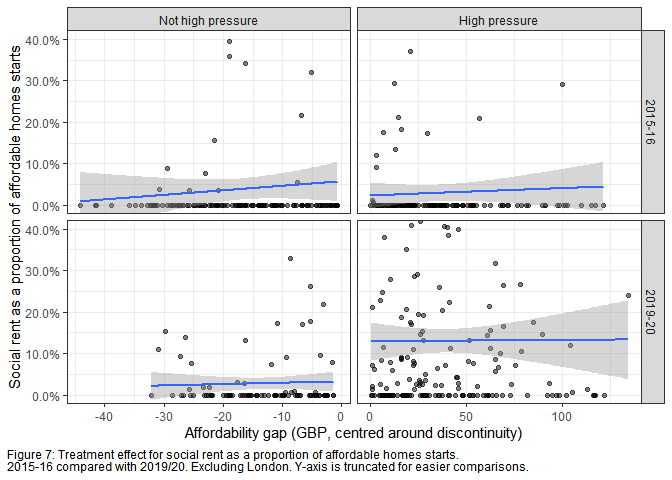<!-- -->

## Social rent starts per 1,000 dwellings

The table below shows the RDD results for the rate of social rent starts
per 1,000 existing dwellings. The ATT is estimated as 0.27 new social
rent starts per 1,000 dwellings in 2019/20, and this effect is
statistically significant. In the subsample sensitivity analysis, the
ATT is estimated at 0.26, and the p-value is below 0.05, which is
interpreted as suggestive of an effect. Figure 8 visualises the ATT,
again showing very little evidence of a treatment effect in 2015/16, but
a clear gap between the intercepts of control and treatment groups in
2019/20.

<table style="text-align:center">
<caption>
<strong>Social Rent Rate RDD results</strong>
</caption>
<tr>
<td colspan="5" style="border-bottom: 1px solid black">
</td>
</tr>
<tr>
<td style="text-align:left">
</td>
<td colspan="4">
<strong>Social rent per 1000 dwellings</strong>
</td>
</tr>
<tr>
<td style="text-align:left">
</td>
<td>
<strong>2015/16</strong>
</td>
<td>
<strong>2019/20</strong>
</td>
<td>
<strong>2015/16: subsample</strong>
</td>
<td>
<strong>2019/20: subsample</strong>
</td>
</tr>
<tr>
<td style="text-align:left">
</td>
<td>
<strong>Model 1</strong>
</td>
<td>
<strong>Model 2</strong>
</td>
<td>
<strong>Model 3</strong>
</td>
<td>
<strong>Model 4</strong>
</td>
</tr>
<tr>
<td colspan="5" style="border-bottom: 1px solid black">
</td>
</tr>
<tr>
<td style="text-align:left">
treatment
</td>
<td>
-0.010
</td>
<td>
0.274
</td>
<td>
-0.002
</td>
<td>
0.255
</td>
</tr>
<tr>
<td style="text-align:left">
</td>
<td>
(0.023)
</td>
<td>
(0.080)\*\*\*
</td>
<td>
(0.039)
</td>
<td>
(0.115)\*
</td>
</tr>
<tr>
<td style="text-align:left">
</td>
<td>
</td>
<td>
</td>
<td>
</td>
<td>
</td>
</tr>
<tr>
<td style="text-align:left">
I(afford_gap_median - 50)
</td>
<td>
0.00001
</td>
<td>
-0.0001
</td>
<td>
-0.0003
</td>
<td>
-0.001
</td>
</tr>
<tr>
<td style="text-align:left">
</td>
<td>
(0.0003)
</td>
<td>
(0.001)
</td>
<td>
(0.001)
</td>
<td>
(0.003)
</td>
</tr>
<tr>
<td style="text-align:left">
</td>
<td>
</td>
<td>
</td>
<td>
</td>
<td>
</td>
</tr>
<tr>
<td style="text-align:left">
Constant
</td>
<td>
0.034
</td>
<td>
0.057
</td>
<td>
0.034
</td>
<td>
0.049
</td>
</tr>
<tr>
<td style="text-align:left">
</td>
<td>
(0.012)\*\*
</td>
<td>
(0.048)
</td>
<td>
(0.022)
</td>
<td>
(0.061)
</td>
</tr>
<tr>
<td style="text-align:left">
</td>
<td>
</td>
<td>
</td>
<td>
</td>
<td>
</td>
</tr>
<tr>
<td style="text-align:left">
N
</td>
<td>
265
</td>
<td>
272
</td>
<td>
183
</td>
<td>
181
</td>
</tr>
<tr>
<td style="text-align:left">
R-squared
</td>
<td>
0.001
</td>
<td>
0.079
</td>
<td>
0.001
</td>
<td>
0.088
</td>
</tr>
<tr>
<td style="text-align:left">
Adj. R-squared
</td>
<td>
-0.006
</td>
<td>
0.072
</td>
<td>
-0.010
</td>
<td>
0.078
</td>
</tr>
<tr>
<td colspan="5" style="border-bottom: 1px solid black">
</td>
</tr>
<tr>
<td colspan="5" style="text-align:left">
***p \< .001; **p \< .005; *p \< .05
</td>
</tr>
</table>

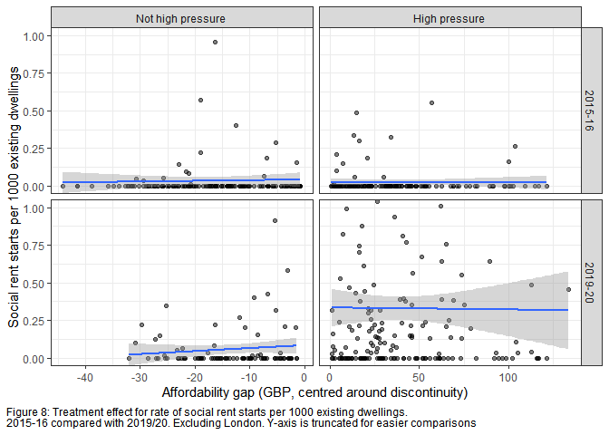<!-- -->

## Social rent starts by PRPs per 1,000 dwellings

The table below shows the RDD results for the rate of social rent starts
by PRPs per 1,000 existing dwellings. The ATT is estimated as 0.12 new
social rent starts by PRPs per 1,000 dwellings in 2019/20, and this
effect is statistically significant. In the subsample sensitivity
analysis, the ATT is estimated at 0.10, and the p-value is below 0.05,
which is interpreted as suggestive of an effect. Figure 9 visualises the
ATT.

<table style="text-align:center">
<caption>
<strong>Social Rent by PRPs Rate RDD results</strong>
</caption>
<tr>
<td colspan="5" style="border-bottom: 1px solid black">
</td>
</tr>
<tr>
<td style="text-align:left">
</td>
<td colspan="4">
<strong>Social rent by PRPs per 1000 dwellings</strong>
</td>
</tr>
<tr>
<td style="text-align:left">
</td>
<td>
<strong>2015/16</strong>
</td>
<td>
<strong>2019/20</strong>
</td>
<td>
<strong>2015/16: subsample</strong>
</td>
<td>
<strong>2019/20: subsample</strong>
</td>
</tr>
<tr>
<td style="text-align:left">
</td>
<td>
<strong>Model 1</strong>
</td>
<td>
<strong>Model 2</strong>
</td>
<td>
<strong>Model 3</strong>
</td>
<td>
<strong>Model 4</strong>
</td>
</tr>
<tr>
<td colspan="5" style="border-bottom: 1px solid black">
</td>
</tr>
<tr>
<td style="text-align:left">
treatment
</td>
<td>
-0.010
</td>
<td>
0.117
</td>
<td>
-0.013
</td>
<td>
0.104
</td>
</tr>
<tr>
<td style="text-align:left">
</td>
<td>
(0.005)\*
</td>
<td>
(0.039)\*\*
</td>
<td>
(0.007)
</td>
<td>
(0.049)\*
</td>
</tr>
<tr>
<td style="text-align:left">
</td>
<td>
</td>
<td>
</td>
<td>
</td>
<td>
</td>
</tr>
<tr>
<td style="text-align:left">
I(afford_gap_median - 50)
</td>
<td>
0.0002
</td>
<td>
0.0004
</td>
<td>
0.0003
</td>
<td>
0.0005
</td>
</tr>
<tr>
<td style="text-align:left">
</td>
<td>
(0.0001)\*
</td>
<td>
(0.001)
</td>
<td>
(0.0002)
</td>
<td>
(0.001)
</td>
</tr>
<tr>
<td style="text-align:left">
</td>
<td>
</td>
<td>
</td>
<td>
</td>
<td>
</td>
</tr>
<tr>
<td style="text-align:left">
Constant
</td>
<td>
0.007
</td>
<td>
0.012
</td>
<td>
0.009
</td>
<td>
0.013
</td>
</tr>
<tr>
<td style="text-align:left">
</td>
<td>
(0.003)\*
</td>
<td>
(0.023)
</td>
<td>
(0.004)\*
</td>
<td>
(0.026)
</td>
</tr>
<tr>
<td style="text-align:left">
</td>
<td>
</td>
<td>
</td>
<td>
</td>
<td>
</td>
</tr>
<tr>
<td style="text-align:left">
N
</td>
<td>
265
</td>
<td>
272
</td>
<td>
183
</td>
<td>
181
</td>
</tr>
<tr>
<td style="text-align:left">
R-squared
</td>
<td>
0.021
</td>
<td>
0.086
</td>
<td>
0.018
</td>
<td>
0.120
</td>
</tr>
<tr>
<td style="text-align:left">
Adj. R-squared
</td>
<td>
0.013
</td>
<td>
0.080
</td>
<td>
0.007
</td>
<td>
0.110
</td>
</tr>
<tr>
<td colspan="5" style="border-bottom: 1px solid black">
</td>
</tr>
<tr>
<td colspan="5" style="text-align:left">
***p \< .001; **p \< .005; *p \< .05
</td>
</tr>
</table>

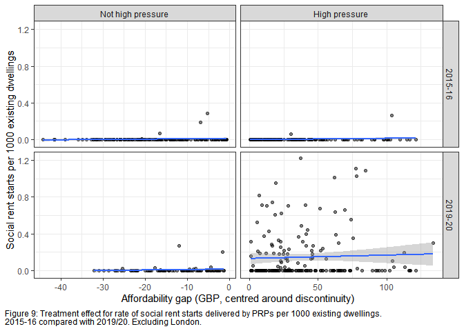<!-- -->

## Total affordable homes starts per 1,000 dwellings

The table below shows the RDD results for rate of total affordable homes
starts per 1,000 existing dwellings. It finds no treatment effect on
total affordable homes starts. This suggests there is no multiplier
effect from the policy change i.e. the grant funding is used by PRPs to
increase the number of social rented homes, not the total number of
homes. Figure 10 visualises the lack of ATT, as there is little gap
between the intercepts of control and treatment groups in both 2015/16
and 2019/20.

<table style="text-align:center">
<caption>
<strong>Total affordable homes RDD results</strong>
</caption>
<tr>
<td colspan="5" style="border-bottom: 1px solid black">
</td>
</tr>
<tr>
<td style="text-align:left">
</td>
<td colspan="4">
<strong>Total affordable homes starts per 1000 dwellings</strong>
</td>
</tr>
<tr>
<td style="text-align:left">
</td>
<td>
<strong>2015/16</strong>
</td>
<td>
<strong>2019/20</strong>
</td>
<td>
<strong>2015/16: subsample</strong>
</td>
<td>
<strong>2019/20: subsample</strong>
</td>
</tr>
<tr>
<td style="text-align:left">
</td>
<td>
<strong>Model 1</strong>
</td>
<td>
<strong>Model 2</strong>
</td>
<td>
<strong>Model 3</strong>
</td>
<td>
<strong>Model 4</strong>
</td>
</tr>
<tr>
<td colspan="5" style="border-bottom: 1px solid black">
</td>
</tr>
<tr>
<td style="text-align:left">
treatment
</td>
<td>
0.524
</td>
<td>
0.522
</td>
<td>
0.214
</td>
<td>
0.358
</td>
</tr>
<tr>
<td style="text-align:left">
</td>
<td>
(0.189)\*
</td>
<td>
(0.371)
</td>
<td>
(0.265)
</td>
<td>
(0.549)
</td>
</tr>
<tr>
<td style="text-align:left">
</td>
<td>
</td>
<td>
</td>
<td>
</td>
<td>
</td>
</tr>
<tr>
<td style="text-align:left">
I(afford_gap_median - 50)
</td>
<td>
-0.003
</td>
<td>
0.005
</td>
<td>
0.005
</td>
<td>
0.003
</td>
</tr>
<tr>
<td style="text-align:left">
</td>
<td>
(0.003)
</td>
<td>
(0.005)
</td>
<td>
(0.008)
</td>
<td>
(0.016)
</td>
</tr>
<tr>
<td style="text-align:left">
</td>
<td>
</td>
<td>
</td>
<td>
</td>
<td>
</td>
</tr>
<tr>
<td style="text-align:left">
Constant
</td>
<td>
0.985
</td>
<td>
2.133
</td>
<td>
1.145
</td>
<td>
2.114
</td>
</tr>
<tr>
<td style="text-align:left">
</td>
<td>
(0.098)\*\*\*
</td>
<td>
(0.225)\*\*\*
</td>
<td>
(0.147)\*\*\*
</td>
<td>
(0.288)\*\*\*
</td>
</tr>
<tr>
<td style="text-align:left">
</td>
<td>
</td>
<td>
</td>
<td>
</td>
<td>
</td>
</tr>
<tr>
<td style="text-align:left">
N
</td>
<td>
265
</td>
<td>
272
</td>
<td>
183
</td>
<td>
181
</td>
</tr>
<tr>
<td style="text-align:left">
R-squared
</td>
<td>
0.039
</td>
<td>
0.034
</td>
<td>
0.033
</td>
<td>
0.016
</td>
</tr>
<tr>
<td style="text-align:left">
Adj. R-squared
</td>
<td>
0.031
</td>
<td>
0.027
</td>
<td>
0.022
</td>
<td>
0.005
</td>
</tr>
<tr>
<td colspan="5" style="border-bottom: 1px solid black">
</td>
</tr>
<tr>
<td colspan="5" style="text-align:left">
***p \< .001; **p \< .005; *p \< .05
</td>
</tr>
</table>

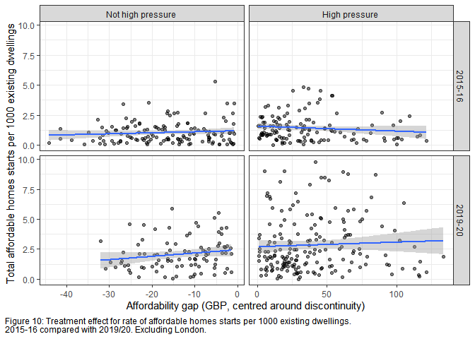<!-- -->

## Placebo - rate of affordable rent starts per 1,000 dwellings

The final analysis shows the placebo of affordable rent starts per 1,000
existing dwellings. It finds no effect of treatment on the rate of
affordable rent starts, providing further support of a treatment effect
from the policy change on social rent starts. Figure 11 visualises the
lack of effect.

<table style="text-align:center">
<caption>
<strong>Affordable rent RDD results</strong>
</caption>
<tr>
<td colspan="5" style="border-bottom: 1px solid black">
</td>
</tr>
<tr>
<td style="text-align:left">
</td>
<td colspan="4">
<strong>Affordable rent starts per 1000 dwellings</strong>
</td>
</tr>
<tr>
<td style="text-align:left">
</td>
<td>
<strong>2015/16</strong>
</td>
<td>
<strong>2019/20</strong>
</td>
<td>
<strong>2015/16: subsample</strong>
</td>
<td>
<strong>2019/20: subsample</strong>
</td>
</tr>
<tr>
<td style="text-align:left">
</td>
<td>
<strong>Model 1</strong>
</td>
<td>
<strong>Model 2</strong>
</td>
<td>
<strong>Model 3</strong>
</td>
<td>
<strong>Model 4</strong>
</td>
</tr>
<tr>
<td colspan="5" style="border-bottom: 1px solid black">
</td>
</tr>
<tr>
<td style="text-align:left">
treatment
</td>
<td>
0.403
</td>
<td>
-0.120
</td>
<td>
0.317
</td>
<td>
-0.044
</td>
</tr>
<tr>
<td style="text-align:left">
</td>
<td>
(0.147)\*
</td>
<td>
(0.227)
</td>
<td>
(0.211)
</td>
<td>
(0.314)
</td>
</tr>
<tr>
<td style="text-align:left">
</td>
<td>
</td>
<td>
</td>
<td>
</td>
<td>
</td>
</tr>
<tr>
<td style="text-align:left">
I(afford_gap_median - 50)
</td>
<td>
-0.004
</td>
<td>
0.003
</td>
<td>
-0.003
</td>
<td>
-0.002
</td>
</tr>
<tr>
<td style="text-align:left">
</td>
<td>
(0.002)
</td>
<td>
(0.003)
</td>
<td>
(0.007)
</td>
<td>
(0.009)
</td>
</tr>
<tr>
<td style="text-align:left">
</td>
<td>
</td>
<td>
</td>
<td>
</td>
<td>
</td>
</tr>
<tr>
<td style="text-align:left">
Constant
</td>
<td>
0.769
</td>
<td>
1.208
</td>
<td>
0.801
</td>
<td>
1.125
</td>
</tr>
<tr>
<td style="text-align:left">
</td>
<td>
(0.076)\*\*\*
</td>
<td>
(0.138)\*\*\*
</td>
<td>
(0.118)\*\*\*
</td>
<td>
(0.165)\*\*\*
</td>
</tr>
<tr>
<td style="text-align:left">
</td>
<td>
</td>
<td>
</td>
<td>
</td>
<td>
</td>
</tr>
<tr>
<td style="text-align:left">
N
</td>
<td>
265
</td>
<td>
272
</td>
<td>
183
</td>
<td>
181
</td>
</tr>
<tr>
<td style="text-align:left">
R-squared
</td>
<td>
0.029
</td>
<td>
0.005
</td>
<td>
0.022
</td>
<td>
0.002
</td>
</tr>
<tr>
<td style="text-align:left">
Adj. R-squared
</td>
<td>
0.021
</td>
<td>
-0.002
</td>
<td>
0.011
</td>
<td>
-0.009
</td>
</tr>
<tr>
<td colspan="5" style="border-bottom: 1px solid black">
</td>
</tr>
<tr>
<td colspan="5" style="text-align:left">
***p \< .001; **p \< .005; *p \< .05
</td>
</tr>
</table>

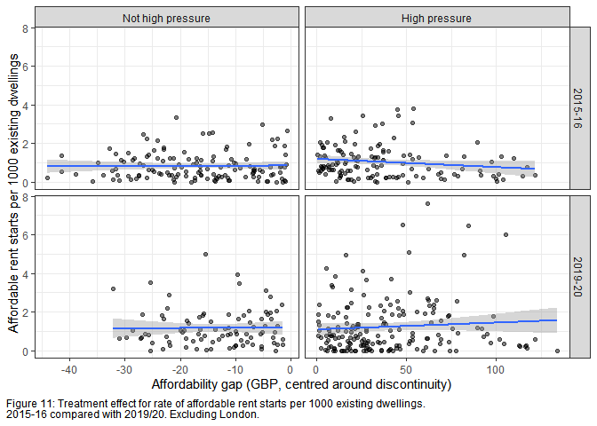<!-- -->
