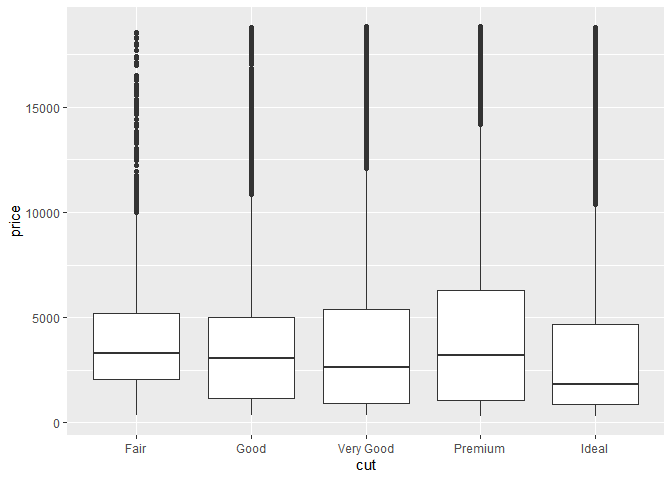

social_rent_rdd_markdown
================
Michael Marshall
24/03/2022

## Test code

This is my test code.

``` r
pacman::p_load(tidyverse)

diamonds %>% 
  ggplot(aes(x = cut, y = price)) +
  geom_boxplot()
```

<!-- -->
